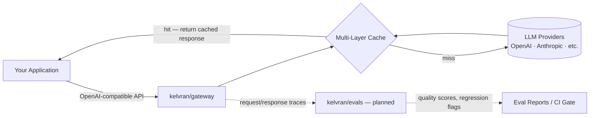

# Kelvran

**LLM gateway with an embedded multi-layer cache, plus a standalone agent-evaluation system.**

## What is Kelvran?

Kelvran is a unified AI infrastructure platform built around two complementary systems: **[gateway](https://github.com/kelvran/gateway)**, a self-hosted LLM gateway with an embedded multi-layer cache that sits between your application and any model provider, cutting latency and cost on repeated calls; and **evals**, a standalone agent-evaluation engine (in development) that will score the quality, correctness, and regressions of what your agents actually produce.

Route and cache with one. Grade the results with the other. Or run both together as one pipeline.

## How it fits together

`gateway` handles the request path in real time: route → check cache → call a provider on miss → populate cache → return. `evals` will run asynchronously against the traces `gateway` emits (or against any agent output fed to it directly) and turn them into scores you can gate a release on.

## Repositories

| Repo | Status | What it does |
|---|---|---|
| [**gateway**](https://github.com/kelvran/gateway) | Live | LLM gateway + embedded multi-layer cache |
| **evals** | Planned — not yet public | Agent/LLM evaluation engine — scoring, regression testing |
| [**.github**](https://github.com/kelvran/.github) | This repo | Org profile + org-wide community health defaults |

## Roadmap

- [x] `gateway`: core routing + multi-layer cache
- [ ] `evals`: initial scoring engine (v0.1)
- [ ] `evals`: CI-gate mode (fail a build on regression)
- [ ] Shared trace format between `gateway` and `evals`
- [ ] Client SDKs (once there's a stable API worth wrapping)
- [ ] Hosted docs site

## Community

- 🐛 Found a bug? [Open an issue](https://github.com/kelvran/gateway/issues/new/choose)
- 📖 Community standards: see this repo for the org-wide `CODE_OF_CONDUCT`, `CONTRIBUTING`, and `SECURITY` policy that every Kelvran repo inherits.
